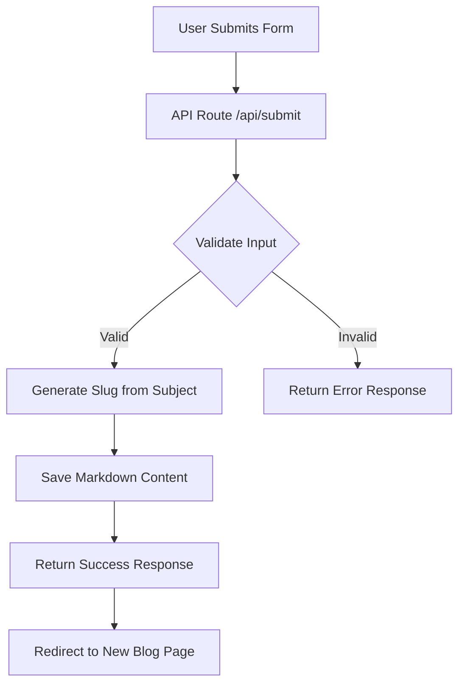
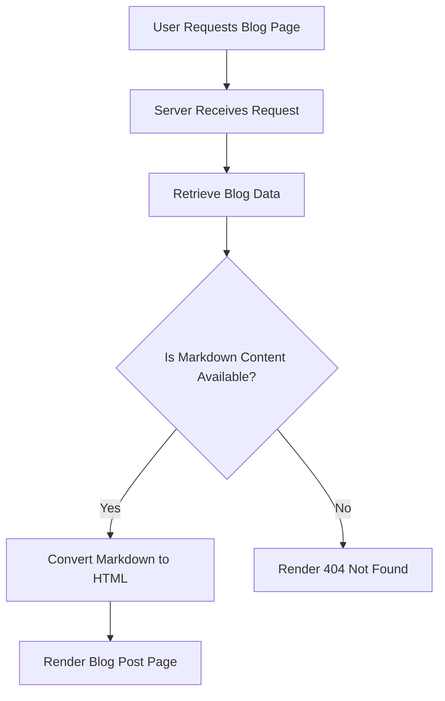
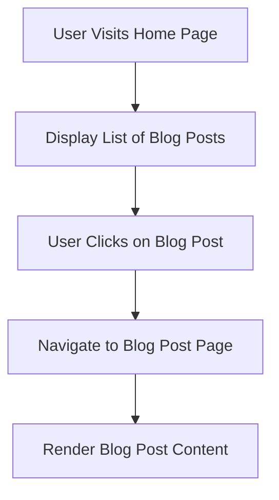

# Interactive Markdown Blog Architecture

This document outlines the main processes and interactions within the Interactive Markdown Blog application, represented through Mermaid diagrams.

## 1. User Submits Blog Post

The following diagram describes the process of a user submitting a blog post. It includes the steps from form submission to storing the blog post content.

### **Instructions**

1. **Create a Markdown File**: Save the above content into a file named `architecture.md` or another appropriate name.
2. **Add to Your Repository**: Add the file to your GitHub repository.
3. **Commit and Push**: Use Git commands or a Git GUI to commit and push the file to your repository.
4. **View the Diagrams on GitHub**: Navigate to the file on GitHub to view the rendered diagrams and content.

This file provides a comprehensive overview of the Interactive Markdown Blog application, making it easier for others to understand the structure and functionality of your project.
